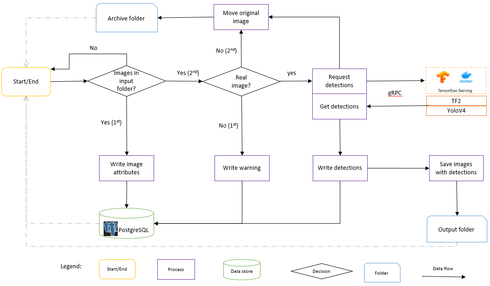

This project is being developed by Urban Big Data Centre and Glasgow City Council with the aim to present regular counts of persons, vehicles  and cyclists from CCTV images in different locations of Glasgow City Centre. At the time of writing (2023.07.03), counts are being made for every 30 minutes of the day, using more than 50 cameras.

This project has currently four areas of development:
1. CCTV Image Capture
2. [CCTV Image Processing](https://github.com/urbanbigdatacentre/glasgow-cctv-object-detection)
3. [CCTV Backend](https://github.com/urbanbigdatacentre/glasgow-cctv/tree/main/projects/backend)
4. [CCTV Frontend](https://github.com/urbanbigdatacentre/glasgow-cctv/tree/main/projects/frontend)

This repo corresponds to the second area of development, that is, **CCTV Image Processing**.

This new release aims to:
- Update and simplify existing code from Tensorflow 1 to Tensorflow 2.
- Deploy in-house trained Yolo model to detect different types of vehicles, pedestrians and cyclists.

A simplified flowchart of all the operations occurring at this stage:



# Getting started
The current project is deployed in an Ubuntu 20.04 LTS server machine. However, it is possible to run this project in any Linux Debian machine with NVIDIA GPU. 

The instalation process consists in installing the GPU NVIDIA drivers, cloning the project, creating the necessary files and folders, and installing required dependencies. Below are my notes to this process.

## Install Docker Engine
This project makes use of Tensorflow Serving container to serve object detections. Follow instructions [here](https://docs.docker.com/engine/install/) to install Docker Engine. Afterwards, don't forget to perform the [Linux post-installation steps for Docker Engine](https://docs.docker.com/engine/install/linux-postinstall/).

## Install NVIDIA CUDA Toolkit

Follow instructions [here](https://developer.nvidia.com/cuda-toolkit-archive) to install the latest release of the CUDA Toolkit and CUDA drivers.

> [!NOTE]
> NVIDIA recommends installing a **distribution-specific** package rather than a **distribution-independent** package. Following NVIDIA's advice, we recommend installing the **deb** option rather than the **run** option.

Finally, don't forget to add the path to the current environment:

```bash
export PATH=/usr/local/<cuda-version>/bin${PATH:+:${PATH}}
```
To make the environment path persistent, add the path to the `.bashrc` configuration file.

3. Install [NVIDIA Container Toolkit](https://docs.nvidia.com/datacenter/cloud-native/container-toolkit/latest/index.html).

4. Test a sample workload to verify installation:
```bash
sudo docker run --rm --runtime=nvidia --gpus all ubuntu nvidia-smi
```
The output should be something like this:
```bash
+-----------------------------------------------------------------------------+
| NVIDIA-SMI 535.86.10    Driver Version: 535.86.10    CUDA Version: 12.2     |
|-------------------------------+----------------------+----------------------+
| GPU  Name        Persistence-M| Bus-Id        Disp.A | Volatile Uncorr. ECC |
| Fan  Temp  Perf  Pwr:Usage/Cap|         Memory-Usage | GPU-Util  Compute M. |
|                               |                      |               MIG M. |
|===============================+======================+======================|
|   0  Tesla T4            On   | 00000000:00:1E.0 Off |                    0 |
| N/A   34C    P8     9W /  70W |      0MiB / 15109MiB |      0%      Default |
|                               |                      |                  N/A |
+-------------------------------+----------------------+----------------------+

+-----------------------------------------------------------------------------+
| Processes:                                                                  |
|  GPU   GI   CI        PID   Type   Process name                  GPU Memory |
|        ID   ID                                                   Usage      |
|=============================================================================|
|  No running processes found                                                 |
+-----------------------------------------------------------------------------+
```

## Install and configure PostgreSQL database

1. [Install latest postgresql](https://www.postgresql.org/download/linux/ubuntu/). Otherwise, it is also possible to use PostgreSQL pre-installed with Ubuntu.

> [!TIP]
> You can find more detailed instructions [here](https://devopscube.com/install-postgresql-on-ubuntu/).

2. Change password for postgres user:
```bash
sudo -u postgres psql
ALTER USER postgres PASSWORD 'myPassword';
```
3. Forbid connection by remote clients: 
Edit file `/etc/postgresql/<postgres-version>/main/postgresql.conf` and uncomment line `#listen_addresses = 'localhost'`

4. Set time zone to **Europe/London** in the file `/etc/postgresql/<postgres-version>/main/postgresql.conf`
```bash
log_timezone = 'Europe/London'
timezone = 'Europe/London'
``` 
5. Restart postgresql and test connection:

```bash
sudo systemctl restart postgresql`
psql -U postgres -h localhost
```

6. Confirm all tcp connections: `ss -nlt`

7. Create `.pgpass` file in home directory to be used by psql:
```bash
# hostname:port:database:username:password
localhost:5432:*:postgres:Str0ngP@ssw0rd
```

> [!TIP]
> To generate a strong password (16 bytes), type  `openssl rand -base64 16` in the cmd line (more info [here](https://ostechnix.com/4-easy-ways-to-generate-a-strong-password-in-linux/)).

Set the proper permission so it would be used by psql:
```bash
sudo chmod 600 .pgpass
```
Finally export PGPASSFILE file to sent environment variable:
```bash
export PGPASSFILE='/home/user/.pgpass'
```
Source: Check [here](https://tableplus.com/blog/2019/09/how-to-use-pgpass-in-postgresql.html).

8. Check if path `/usr/bin` is an environment variable. If not set it up in the `.bashrc` file:
```bash
export PATH=/usr/bin:$PATH
```

## Install and configure Miniconda

Follow instructions [here](https://docs.anaconda.com/free/miniconda/#quick-command-line-install) to install miniconda in your machine.

> [!TIP]
> To prevent Conda from activating the base environment by default, do the following:
> ```bash
> conda config --set auto_activate_base false
> ```

Create a conda environment for the CCTV project with python 3.8.10:
```bash
conda create -n cctv python=3.8.10
```

## Install and configure CCTV project and dependencies

1. Git clone the project within the folder where you want it to be installed:
```bash
git clone git@github.com:urbanbigdatacentre/glasgow-cctv-object-detection.git
```

2. Positioned inside the cloned directory, create database `detections` and tables:
```bash
psql -U postgres -h localhost -f ./general_utils/create_detection_tables.sql
```

3. Download the models `faster_rcnn_1024_parent.tar.gz` and `yolov4_9_objs.tar.gz` from https://github.com/urbanbigdatacentre/glasgow-cctv-object-detection/releases/tag/v1.0.0. Afterwards, copy the two files to the sub-directory `models/`, inside the project directory. Unzip both files with the following bash command:
```bash
tar -xzvf faster_rcnn_1024_parent.tar.gz
tar -xzvf yolov4_9_objs.tar.gz
```

> [!NOTE]
> Since the CCTV GitHub repo is private, you can only download the models interactively or by using the [GitHub CLI](https://cli.github.com/). If the repo were public, `wget` or `curl` tools could also be used.

4. Install Python packages and dependencies, with the conda cctv project activated and positioned inside the cloned directory:
```bash
conda activate cctv
pip install -r ./general_utils/requirements.txt
```

> [!WARNING]
> Requirements may differ for different Python versions and Ubuntu machines. The requirements presented here were tested for Python 3.8.10 running on Ubuntu 22.04 LTS or Ubuntu 20.04 LTS operating systems.

5. Update all files, especially the bash files!
In the file `monitor_images_input_folder.sh` change the path of the activation of the conda cctv environment.
In the file `process_images_input_folder.sh` change the path of the activation of the conda cctv environment.

6. Create a cron task to access database, produce a daily gzip file and send it to the aws bucket `crontab -e`:
```bash
SHELL=/bin/bash
PATH=copy-env-path-here
@reboot /home/datasci/Work/glasgow-cctv-object-detection/general_utils/reboot_monitor.sh
0  2  *  *  * /home/user/glasgow-cctv-object-detection/process_yesterday_data.sh > /dev/null 2>&1
```

7. Check if `identify` already exists:
```bash
identify --version
```
If not install with:
```bash
sudo apt install imagemagick
```

8. Change the paths for the location of the main project folder in the `reboot_monitor.sh`  and `load_tf_serving.sh` files.

9. Create the following sub-directories in the project main directory:
```bash
mkdir archive_folder input_folder output_folder daily_reports logs && mkdir logs/aws logs/analyses logs/yesterday
```

10. Run tensorflow serving container and monitor bash file:
```bash
./general_utils/load_tf_serving.sh
./general_utils/reboot_monitor.sh
```
11. Test system with a couple of test images by copying or moving some images to the `input_folder`.  

12. Run one colour image `dark_yellow_canvas.jpg` provided, with tf2 model. Check maximum confidence score obtained in detections list. Afterwards, replace following threshold number in `detections_main.py` file:
```python
detections[0]['score'] > 0.0001317993737757206):
```

> [!NOTE]
> Column `camera_ref` from table `images` in the database detections, corresponds to the reference of the camera that produced the image. Not to be confused with `camera_id`. The same camera can take more than one image. Hence, `camera_id` may have more than one `camera_ref`. In other words: `camera_ref = camera_id + camera_preset_id`. Example: camera ref "G57P1" = camera_id "G57" + camera_preset_id "P1". "P1" means "preset 1". Other presets could be added to the same camera.

> [!NOTE]
> All detected objects of interest are written to the database. However, only the bounding boxes of the objects whose confidence score is greater than 50%, are written onto the images, for visual clarity.
