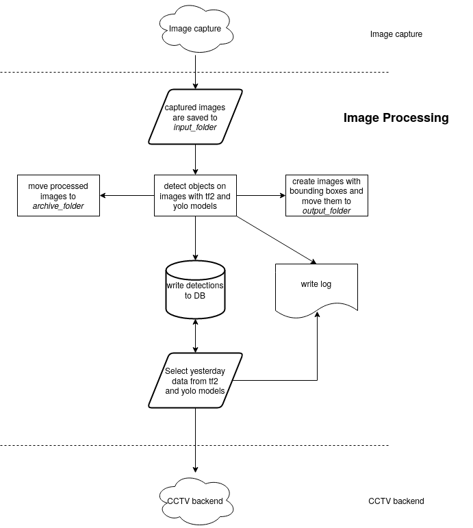

This project is being developed by Urban Big Data Centre and Glasgow City Council with the aim to present regular counts of persons, vehicles  and cyclists from CCTV images in different locations of Glasgow City Centre. At the time of writing (2023.07.03), counts are being made for every 30 minutes of the day, using more than 50 cameras.

This project has currently four areas of development:
1. Capture of images
2. Process of images
3. [CCTV backend](https://github.com/urbanbigdatacentre/cctv-backend)
4. [CCTV frontend](https://github.com/urbanbigdatacentre/cctv-frontend)

This repo corresponds to the process of images.

This new release aims to:
- Update and simplify existing code from Tensorflow 1 to Tensorflow 2.
- Deploy in-house trained Yolo model to detect different types of vehicles, pedestrians and cyclists.

A simplified flowchart of all the operations occurring at this stage:



## Getting started
The current project is deployed in an Ubuntu 20.04 LTS server machine. The instalation process consists in creating all the necessary folders and installing the required software. Below are my notes to this process.

Postgres database configuration:

1. [Install latest postgresql](https://www.postgresql.org/download/linux/ubuntu/). Otherwise, it is also possible to use PostgreSQL pre-installed with Ubuntu.

Change password for *postgres*
```bash
sudo -u postgres psql
ALTER USER postgres PASSWORD 'myPassword';
```
You can find more detailed instructions [here](https://devopscube.com/install-postgresql-on-ubuntu/).

file "/etc/postgresql/14/main/postgresql.conf":
Uncomment the line "#listen_addresses = 'localhost'" to forbid connection by remote clients 

Time zone in the file "sudo vim /etc/postgresql/15/main/postgresql.conf" must be set to 'Europe/London'. Afterwards restart postgresql: 'sudo systemctl restart postgresql':
```bash
log_timezone = 'Europe/London'
timezone = 'Europe/London'
```

Test connection with something like: 
```bash
psql -U postgres -h localhost
```

In case I need to restart postgres service: "sudo systemctl restart postgresql"
Confirm all tcp connections: "ss -nlt"

Create .pgpass file at the home directory (ex.):
# hostname:port:database:username:password
localhost:5432:*:postgres:Str0ngP@ssw0rd

To generate a strong password (16 bytes), type in the cmd line (https://ostechnix.com/4-easy-ways-to-generate-a-strong-password-in-linux/): "openssl rand -base64 16"

Follow remaining isntructions in: https://tableplus.com/blog/2019/09/how-to-use-pgpass-in-postgresql.html

Check if path /usr/bin is an environment variable. if not set it up in the .bashrc file: export PATH=/usr/bin:$PATH

Git clone project from GitHub and go to created directory.

Inside the cloned directory, create database detections and tables:
```bash
psql -U postgres -h localhost -f ./general_utils/create_detection_tables.sql

```
In this directory, create the following directories:
```bash
mkdir archive_folder daily_reports input_folder logs\analyses logs\aws logs\yesterday output_folder
```
Copy zip file "C:\Users\ls283h\OneDrive - University of Glasgow\cctv_object_detection_v2\UBDC2_server\to_ubdc2_20230502.zip" to the working directory. Unzip and move directories models\faster_rcnn_1024_parent and models\yolov4_9_objs to models\.

Update all files, especially the bash files!
In the file "monitor_images_input_folder.sh" change the line correspondent to the activation of the virtualenv.
In the file "process_images_input_folder.sh" change the line correspondent to the activation of the virtualenv.

Create a cron task to access database, produce a daily gzip file and send it to the aws bucket (crontab -e):
```bash
SHELL=/bin/bash
PATH=copy-env-path-here
@reboot /home/datasci/Work/glasgow-cctv-object-detection/reboot_monitor.sh
0  2  *  *  * /home/user/glasgow-cctv-object-detection/process_yesterday_data.sh > /dev/null 2>&1
30  2  *  *  * /home/user/glasgow-cctv-object-detection/faulty.sh > /dev/null 2>&1
0  3  *  *  * /home/user/glasgow-cctv-object-detection/analyse_yesterday_data.sh > /dev/null 2>&1
```

Install library psycopg in the python environment: "pip install psycopg2". For problems related with prerequisites, refer to manual page: "https://www.psycopg.org/docs/install.html#quick-install".

Check if "identify" already exists with: $identify --version. If not install with: sudo apt install imagemagick.

Check path of the file "reboot_monitor.sh"

Requirements may differ for diifferent Ubuntu releases. Check (and eventually install) file "requirements.txt" provided.

Need to test system with a couple of test images (monitor and process bash files).

Run a mono colour image (dark_yellow_canvas.jpg) with tf2 model and check the maximum confidence score obtained in detections list. Afterwards, replace following threshold number in "detections_main.py" file:
```python
detections[0]['score'] > 0.0001317993737757206):
```

Some notes:
- The column 'camera\_ref' from table 'images' in the database detections, corresponds to the reference of the camera that produced the image. Not to be confused with 'camera\_id'. The same camera can take more than one image. Hence, 'camera\_id' may have more than one 'camera\_ref'. In other words: "camera\_ref = camera\_id + camera\_preset\_id". Example: camera ref "G57P1" = camera\_id "G57" + camera\_preset\_id "P1". "P1" means "preset 1". Other presets could be added to the same camera.

All detected objects of interest are written to the database. However, only objects with a confidence score greater than 50% are written onto the images (in the form of bounding boxes encircling the object), for visual clarity.
